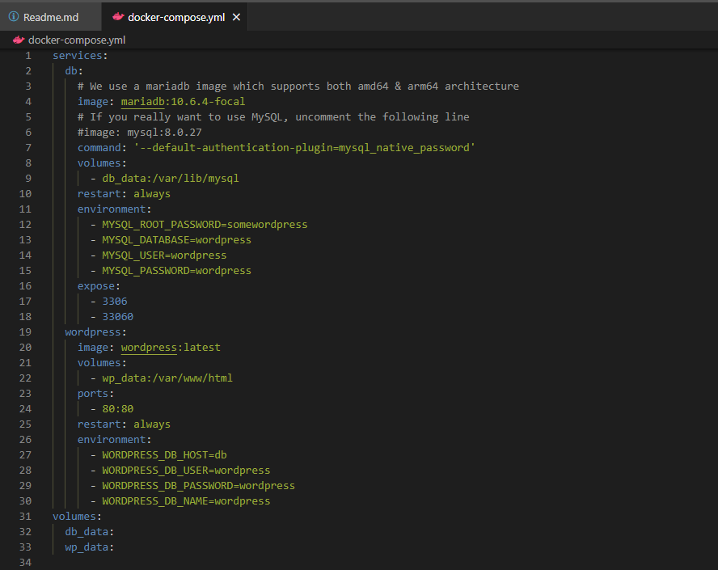
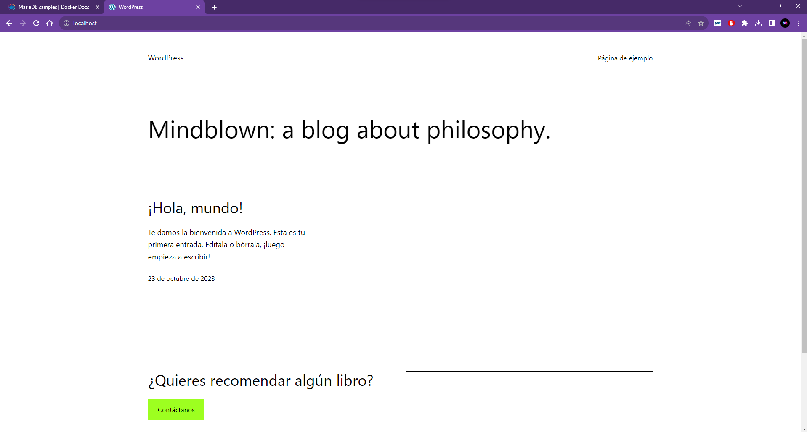

# Wordpress con docker compose

Lo primero que tenemos que hacer es buscar la imagen de wordpress, esta la podemos encontrar tanto en [**docker hub**](https://hub.docker.com/_/wordpress) como en [**docker docs**](https://docs.docker.com/samples/mariadb/). En mi caso voy a utilizar  [**docker docs**](https://docs.docker.com/samples/mariadb/) dentro de este tenemos que entrar en el enlaze [Compose and WordPress](https://github.com/docker/awesome-compose/tree/master/official-documentation-samples/wordpress/) este nos llevará a un repositorio de github donde podremos ver como es el docker compose.

El siguiente paso es crear nuestro propio docker-compose.yml

Este codigo almacena la informacion en MariaDB. Esta base de datos usa los puertos 3306 y 33060 para que los diferentes servicios se puedan comunicar con ella.
En este codigo estamos utilizando la ultima plataforma de WordPress y este utiliza el puerto 80.

Una vez tenemos el docker-compose.yml creado debemos iniciar un contenedor con el comando: 
`docker compose up -d`
Una vez creado el contenedor podemos entrar en nuesrto navegador y utilizamos el localhost para comporbar que funcione, en el caso de que funcione nos deberia aparecer algo parecido a esto:

